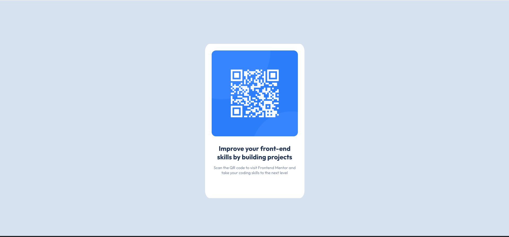
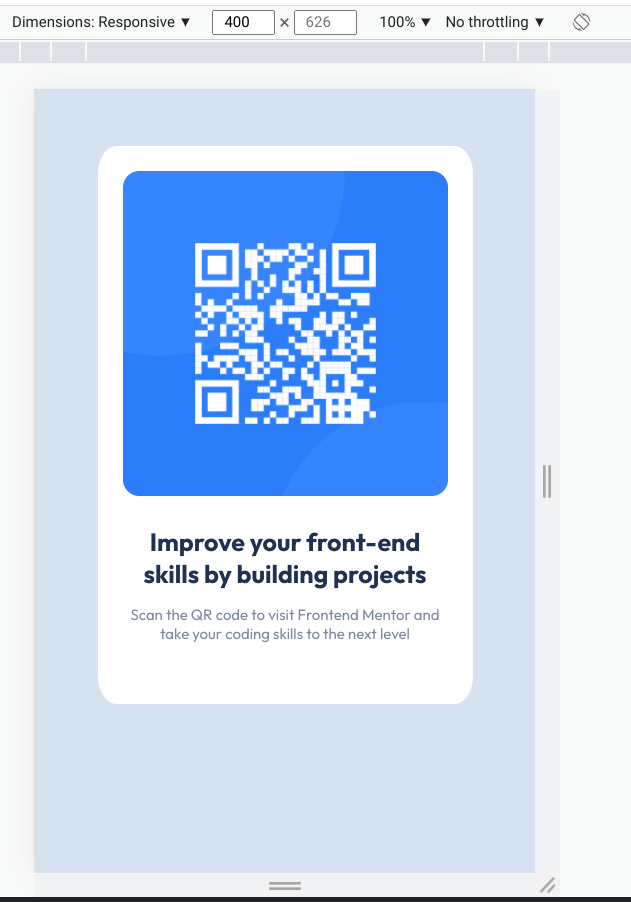

# Frontend Mentor - QR code component solution

This is a solution to the [QR code component challenge on Frontend Mentor](https://www.frontendmentor.io/challenges/qr-code-component-iux_sIO_H). Frontend Mentor challenges help you improve your coding skills by building realistic projects.

## Table of contents

- [Overview](#overview)
  - [Screenshot](#screenshot)
  - [Links](#links)
- [My process](#my-process)
  - [Built with](#built-with)
  - [What I learned](#what-i-learned)
  - [Continued development](#continued-development)
  - [Useful resources](#useful-resources)
- [Author](#author)
- [Acknowledgments](#acknowledgments)

**Note: Delete this note and update the table of contents based on what sections you keep.**

## Overview

### Screenshot





### Links

- Solution URL: [Add solution URL here](https://your-solution-url.com)
- Live Site URL: [Add live site URL here](https://your-live-site-url.com)

## My process

### Built with

- Semantic HTML5 markup
- CSS custom properties
- Bootstrap

**Note: These are just examples. Delete this note and replace the list above with your own choices**

### What I learned

I reinforced some concepts that I never had to implement on my own before. Remembering that changing the body background color was my, "Oh your are an idiot moment."  I struggled initially with centering the content. I did a fair amount of googling. Learned more about flexboxes.

```html
<h1>Some HTML code I'm proud of</h1>
<div class="card">
  <div class="card-text">
    <h5>Improve your front-end skills by building projects</h3>
      <p>Scan the QR code to visit Frontend Mentor and take your coding skills to the next level</p>
  </div>
</div>
```
```css
body{
background-color:hsl(212, 45%, 89%);
font-family: 'Outfit', sans-serif;
text-align: center;
margin:20% 5% 5% 5%;
display:flex;
flex-direction:column;
align-items: center;
min-height:100vh;
justify-content: center;
}

```


### Continued development

Still work on the basics of html and css. Need to get more comfortable with flex boxes, padding and margins.


### Useful resources

- [Resource 1](https://developer.mozilla.org/en-US/docs/Web/CSS/CSS_Flexible_Box_Layout/Aligning_Items_in_a_Flex_Container) - This helped me for XYZ reason. I really liked this pattern and will use it going forward.


## Author

- Frontend Mentor - [@Henryallthumbs](https://www.frontendmentor.io/profile/Henryallthumbs)


## Acknowledgments
